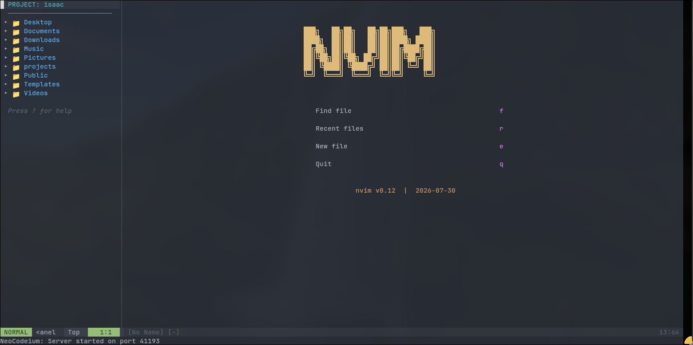

# project-panel.nvim

`project-panel.nvim` is a lightweight VS Code-style project and file explorer
for Neovim. It opens a fixed-width sidebar that follows the current working
directory, renders a navigable directory tree, and provides common file
operations without leaving the editor.



## Features

- Hierarchical directory tree for the current project or workspace
- Expand and collapse folders from a sidebar buffer
- Open files in the active editing window
- Create, rename, move, and delete files or folders
- Change the explorer root to a selected folder or move up to the parent
- Optional Nerd Font icons through `nvim-web-devicons`
- Auto-refresh support for working-directory changes
- Configurable width, side, hidden-file visibility, and icons
- Built-in diagnostics for common plugin and keymap conflicts

## Requirements

- Neovim 0.7 or newer
- Lua support enabled in Neovim
- Optional: a Nerd Font-compatible terminal font
- Optional: [`nvim-tree/nvim-web-devicons`](https://github.com/nvim-tree/nvim-web-devicons)
  for file-type icons

## Installation

Install the plugin with your preferred Neovim plugin manager.

### lazy.nvim

```lua
{
  "your-username/projectpenel",
  dependencies = {
    "nvim-tree/nvim-web-devicons", -- optional
  },
  config = function()
    require("project-panel").setup({
      width = 30,
      position = "left",
      auto_open = false,
      show_hidden = false,
    })
  end,
  keys = {
    { "<leader>pp", "<cmd>ProjectPanelToggle<cr>", desc = "Toggle Project Panel" },
  },
}
```

For local development from this repository:

```lua
{
  dir = "~/Documents/projectpenel",
  name = "project-panel.nvim",
  dependencies = {
    "nvim-tree/nvim-web-devicons", -- optional
  },
  config = function()
    require("project-panel").setup()
  end,
}
```

### packer.nvim

```lua
use {
  "your-username/projectpenel",
  requires = {
    "nvim-tree/nvim-web-devicons", -- optional
  },
  config = function()
    require("project-panel").setup()
  end
}
```

### Native Packages

Clone the repository into a Neovim package directory:

```bash
git clone https://github.com/your-username/projectpenel.git \
  ~/.local/share/nvim/site/pack/plugins/start/project-panel.nvim
```

Then start Neovim and run:

```vim
:helptags ALL
```

## Configuration

Call `setup()` from your Neovim configuration:

```lua
require("project-panel").setup({
  width = 30,
  position = "left",
  auto_open = false,
  show_hidden = false,
  use_nerd_fonts = true,
  icons = {
    folder_closed = "",
    folder_open = "",
    default_file = "󰈔",
    arrow_closed = "",
    arrow_open = "",
  },
})
```

### Options

| Option | Type | Default | Description |
| --- | --- | --- | --- |
| `width` | number | `30` | Sidebar width in columns. |
| `position` | string | `"left"` | Sidebar position. Use `"left"` or `"right"`. |
| `auto_open` | boolean | `false` | Open the panel shortly after startup. |
| `show_hidden` | boolean | `false` | Show files and folders whose names begin with `.`. |
| `use_nerd_fonts` | boolean | auto-detected | Use Nerd Font icons when available. |
| `icons` | table | see example | Override folder, file, and arrow icons. |

## Usage

Open the project panel:

```vim
:ProjectPanel
```

Toggle it with a keymap:

```lua
vim.keymap.set("n", "<leader>pp", "<cmd>ProjectPanelToggle<cr>", {
  desc = "Toggle Project Panel",
})
```

Open the panel at a specific directory from Lua:

```lua
require("project-panel").open("~/projects/example")
```

Display the built-in diagnostics report:

```vim
:ProjectPanelCheck
```

## Commands

| Command | Description |
| --- | --- |
| `:ProjectPanel` | Open the project panel. |
| `:ProjectPanelClose` | Close the project panel. |
| `:ProjectPanelToggle` | Toggle the project panel. |
| `:ProjectPanelRefresh` | Refresh the file explorer tree. |
| `:ProjectPanelCheck` | Show diagnostics for optional dependencies, command registration, and keymap conflicts. |

## Keymaps

These mappings are available inside the project panel buffer.

| Key | Action |
| --- | --- |
| `<CR>` / `o` | Open a file or expand/collapse a folder. |
| `a` | Create a file or folder. End the path with `/` to create a folder. |
| `r` | Rename the selected file or folder. |
| `d` | Delete the selected file or folder after confirmation. |
| `m` | Move the selected file or folder to a new path. |
| `-` / `u` | Move the panel root up to the parent directory. |
| `C` | Set the selected folder as the panel root. |
| `R` | Refresh the tree. |
| `?` | Show the help window. |
| `q` / `<Esc>` | Close the panel or help window. |

## Dependencies

### Required

- Neovim with Lua support

### Optional

- `nvim-tree/nvim-web-devicons`: enables file-type icons when available
- Nerd Font: recommended when `use_nerd_fonts` is enabled

The plugin falls back to basic icons when optional icon support is unavailable.

## Development

Use the included development `init.lua` to load this repository directly:

```bash
nvim -u init.lua
```

Inside Neovim, run:

```vim
:ProjectPanel
```

The help documentation is available in `doc/project-panel.txt`. After changing
help tags, regenerate them with:

```vim
:helptags doc
```

## Contributing

Contributions are welcome. To keep changes easy to review:

1. Fork the repository and create a focused feature branch.
2. Keep behavior changes small and documented.
3. Follow the existing Lua style and Neovim API patterns.
4. Update `README.md` and `doc/project-panel.txt` when user-facing behavior changes.
5. Test the plugin in a clean Neovim session before opening a pull request.

When reporting bugs, include:

- Your Neovim version
- Your plugin manager
- Relevant configuration
- Steps to reproduce the issue
- Expected and actual behavior

## License

This project is distributed under the MIT License. See [LICENSE](./LICENSE) for
details.
